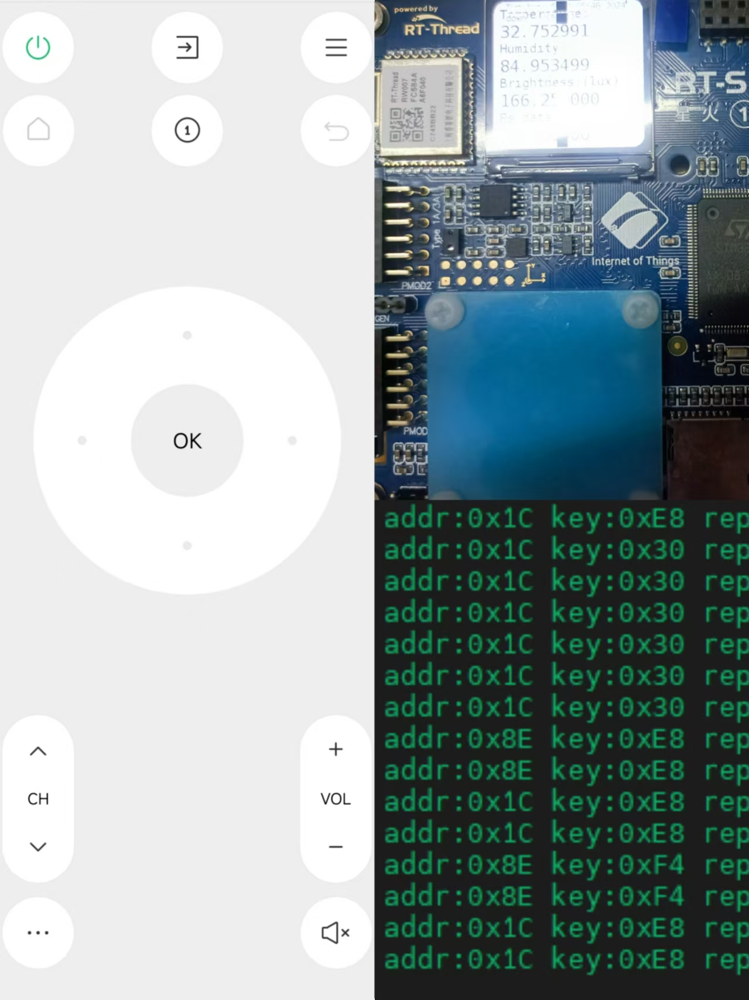
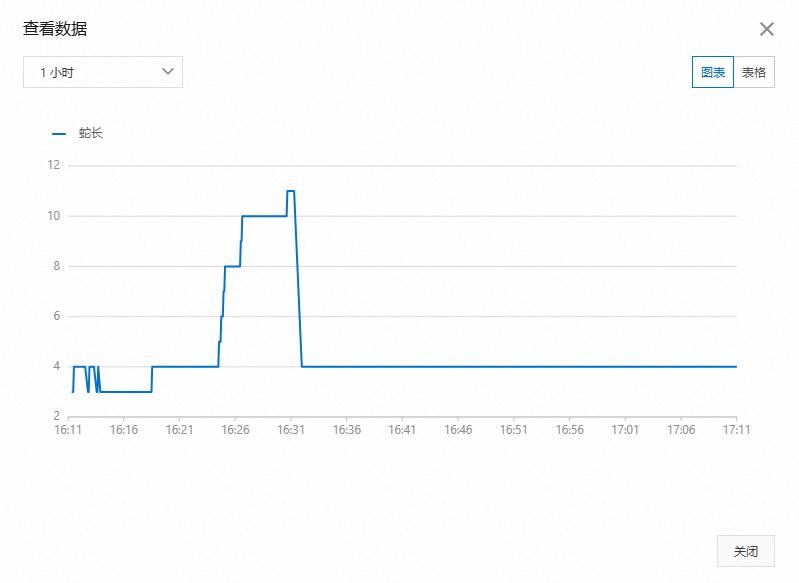
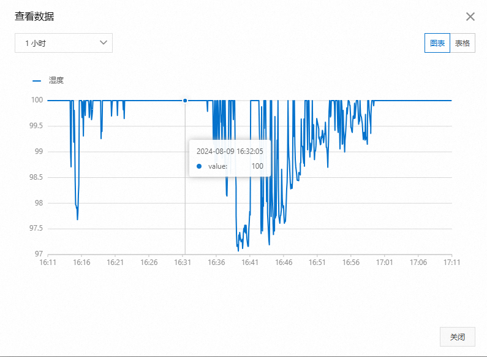
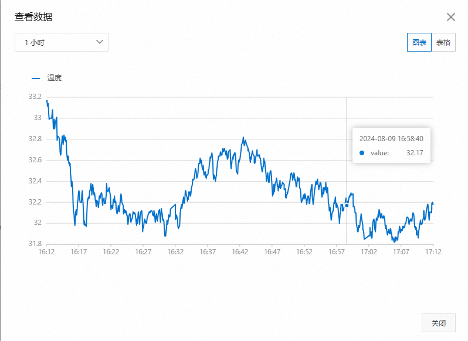
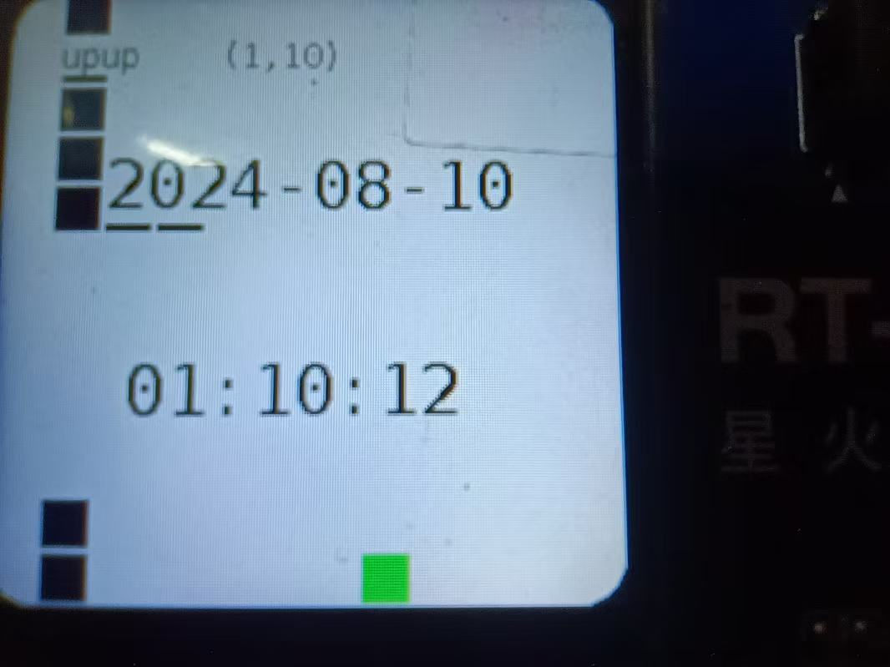
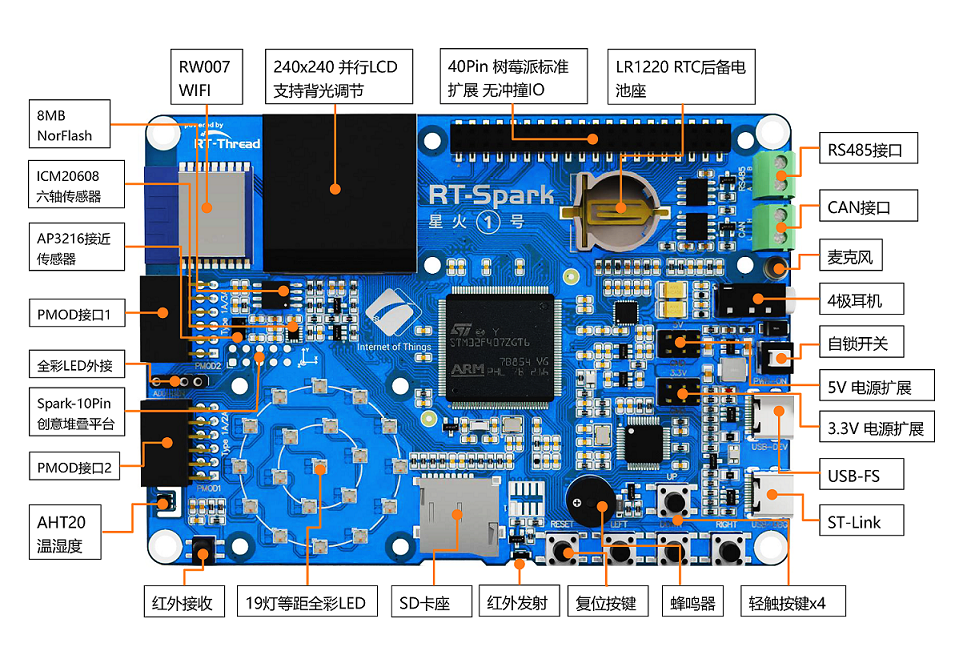

# 红外遥控贪吃蛇/显示+上传温度等数据


[成果展示链接(new)](https://www.bilibili.com/video/BV1VqeceTEts)
[简略教程链接(https://www.bilibili.com/video/BV15uYqeME6t)](https://www.bilibili.com/video/BV15uYqeME6t)
[成果展示链接(https://www.bilibili.com/video/BV1x3YSesEcw)](https://www.bilibili.com/video/BV1x3YSesEcw)
### 红外遥控贪吃蛇



### 红外遥控器
| 编号（key）| 功能 |
| :----: | :----: |
| 0x30| 上 |
| 0xE8 | 左 |
| 0xB0 | 下 |
| 0x68 | 右 |
| 0xFF | OK |
| 0x38 | 电源键 |
| 0xA8 | 静音 |
| 0x88 | 菜单 |
| 0x28 | 退出 |


### LCD 显示温湿度

左上角是（0，0） →x，↓y

### 简易贪吃蛇


### 页面切换、冻结（贪吃蛇与数据显示）
``` c
// 菜单（切换页面）
    if (repeat == 0 && (rt_strcmp(tmp, "88") == 0 || rt_strcmp(tmp, "11") == 0))
    {
        page_chosen = (page_chosen % PAGE_MAX) + 1;
        page_first = 1;
        rt_kprintf("page_chosen = %d\n", page_chosen);
    }
    // 确认（暂停、页面冻结）
    if (repeat == 0 && (rt_strcmp(tmp, "73") == 0))
    {
        page_stop = (page_stop + 1) % 2;
        if (page_stop == 1)
        {
            lcd_show_string(240 - 24 * 3, 240 - 24, 24, "Stop");
        }
        else
        {
            lcd_show_string(240 - 24 * 3, 240 - 24, 24, "    ");
        }
    }
```

### MQTT上传到阿里云
#### 光照强度
 
#### 接近感应
 
#### 蛇长
 
#### 湿度
 
#### 温度


### 显示时间

[参考(https://blog.csdn.net/toopoo/article/details/113665077)](https://blog.csdn.net/toopoo/article/details/113665077)
``` c
void greattime()
{
    time_t cur_time;
    struct tm *info;
    cur_time = ntp_get_time(RT_NULL);
    info=localtime(&cur_time);
    strftime(tmp, 80, "%Y-%m-%d", info);
    lcd_show_string(40, 240/2-32-24, 32, tmp);
    strftime(tmp, 80, "%H:%M:%S", info);
    lcd_show_string(50, 240/2+24, 32, tmp);
    if (cur_time)
    {
        rt_kprintf("NTP Server Time: %s", ctime((const time_t *)&cur_time));
    }
}
```

# STM32F407 星火一号开发板 BSP 说明

## 简介

本文档为 RT-Thread 开发团队为 STM32F407 星火1号开发板提供的 BSP (板级支持包) 说明。

主要内容如下：

- 开发板资源介绍
- BSP 快速上手
- 进阶使用方法

通过阅读快速上手章节开发者可以快速地上手该 BSP，将 RT-Thread 运行在开发板上。在进阶使用指南章节，将会介绍更多高级功能，帮助开发者利用 RT-Thread 驱动更多板载资源。

## 开发板介绍

星火号 STM32F407 是RT-THREAD推出的一款基于 ARM Cortex-M4 内核的开发板，最高主频为 168Mhz，该开发板具有丰富的板载资源，可以充分发挥 STM32F407 的芯片性能。

开发板外观如下图所示：



该开发板常用 **板载资源** 如下：

- MCU：STM32F407ZGT6，主频 168MHz，1024KB FLASH ，192KB RAM
- 外部 FLASH：W25Q128（SPI，16MB）
- 常用外设
  - LED：2个，LED_R（红色，PF12），LED_B（绿色，PF11）
  - 按键，4个，KEY_UP（兼具唤醒功能，PIN：PC5），KEY_DOWN（PIN：PC1），KEY_LEFT（PIN：PC0），KEY_RIGHT（PIN：PC4）
- 常用接口：USB 转串口、SD 卡接口、USB SLAVE、USB HOST
- 调试接口，标准ST-LINK

开发板更多详细信息请参考官方文档 [STM32 星火一号开发板介绍](https://www.rt-thread.org/document/site/#/rt-thread-version/rt-thread-standard/hw-board/spark-1/spark-1)。

## 外设支持

本 BSP 目前对外设的支持情况如下：

| **板载外设** | **支持情况** |               **备注**                |
| :------------ | :----------: | :-----------------------------------: |
| USB 转串口(COM1) |     支持     |                                    |
| COM2         |   支持  | 和以太网、PWM 冲突，如需使用该外设，请使用 CubeMX 重新配置 UART2 管脚 |
| COM3         |  支持   |                                           |
| **片上外设** | **支持情况** |               **备注**                |
| UART         |     支持     |              UART1/2/3              |
| SPI          |     支持     |               SPI1/2/3                |
| ADC          |     支持     |                                       |
| RTC          |     支持     | 支持外部晶振和内部低速时钟 |
| WDT          |     支持     |                                       |


## 使用说明

使用说明分为如下两个章节：

- 快速上手

    本章节是为刚接触 RT-Thread 的新手准备的使用说明，遵循简单的步骤即可将 RT-Thread 操作系统运行在该开发板上，看到实验效果 。

- 进阶使用

    本章节是为需要在 RT-Thread 操作系统上使用更多开发板资源的开发者准备的。通过使用 ENV 工具对 BSP 进行配置，可以开启更多板载资源，实现更多高级功能。


### 快速上手

本 BSP 为开发者提供 MDK5 和 IAR 工程，并且支持 GCC 开发环境。下面以 MDK5 开发环境为例，介绍如何将系统运行起来。

#### 硬件连接

使用数据线连接开发板到 PC，打开电源开关。

#### 编译下载

双击 project.uvprojx 文件，打开 MDK5 工程，编译并下载程序到开发板。

> 工程默认配置使用 JLink 下载程序，在通过 JLink 连接开发板的基础上，点击下载按钮即可下载程序到开发板

#### 运行结果

下载程序成功之后，系统会自动运行，观察开发板上 LED 的运行效果，红色 LED 常亮、绿色 LED 会周期性闪烁。

连接开发板对应串口到 PC , 在终端工具里打开相应的串口（115200-8-1-N），复位设备后，可以看到 RT-Thread 的输出信息:

```bash

 \ | /
- RT -     Thread Operating System
 / | \     5.0.1 build Jul  4 2023 07:49:10
 2006 - 2022 Copyright by RT-Thread team
msh >
```
### 进阶使用

此 BSP 默认只开启了 GPIO 和 串口1 的功能，如果需使用 SD 卡、Flash 等更多高级功能，需要利用 ENV 工具对BSP 进行配置，步骤如下：

1. 在 bsp 下打开 env 工具。

2. 输入`menuconfig`命令配置工程，配置好之后保存退出。

3. 输入`pkgs --update`命令更新软件包。

4. 输入`scons --target=mdk5/iar` 命令重新生成工程。

本章节更多详细的介绍请参考 [STM32 系列 BSP 外设驱动使用教程](../docs/STM32系列BSP外设驱动使用教程.md)。

## 注意事项

暂无

## 联系人信息

维护人:

- [Supperthomas](https://github.com/supperthomas)
