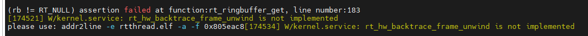
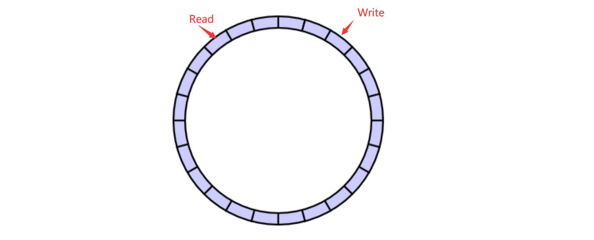
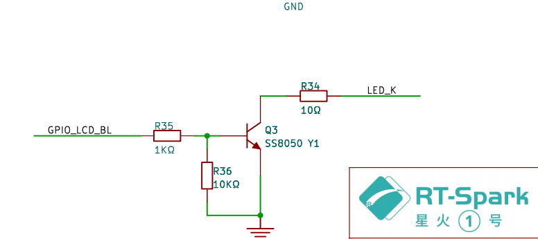
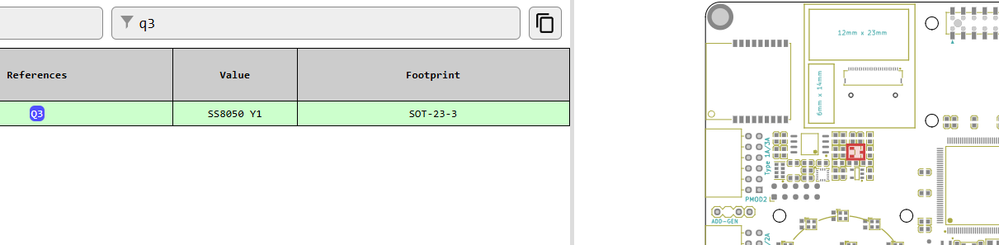
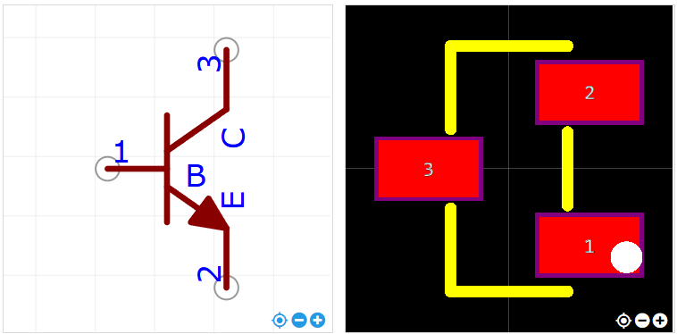
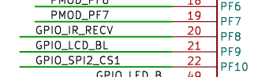
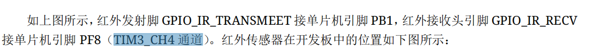
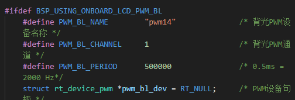
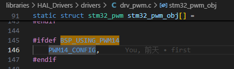

换了env2就可以？


移出来+头文件可以编译
但

对照示例0.1.1版什么都不用做，也不会报错什么没定义
对比.config/rtconfig.h
但发了红外线也没反应……
再加回接收、发送
又是没定义
对比.config/rtconfig.h
调整好pin，timer，#define ***timer
总算可以了
调整好针脚等可以运行了，但一闪一闪的，估计是线程切换的原因？
注释掉红外线线程，也没有用，改了优先级终于可以了
**破案了！lcd、红外线用的同一个timer14，[哭笑不得]😂**
换了个timer11就不闪了！！！
``` c
Snake_Thread = rt_thread_create("Snake_Thread", snake_entry, RT_NULL, THREAD_STACK_SIZE, 10, THREAD_TIMESLICE);
```
不注释又闪了，
加到myproject，没唤醒时没事，唤醒后闪，重启也闪

### GET_PIN(F, 11) 的头文件

``` c
#include <drv_gpio.h>
/* 配置 LED 灯引脚 */
#define PIN_LED_B GET_PIN(F, 11) // PF11 :  LED_B        --> LED
#define PIN_LED_R GET_PIN(F, 12) // PF12 :  LED_R        --> LED
```

### 红外线遥控器按键值
原来要按两次key才变，搞得还以为昨天找到的都是乱输出的

| 编号（key）| 功能 |
| :----: | :----: |
| 0x30| 上 |
| 0xE8 | 左 |
| 0xB0 | 下 |
| 0x68 | 右 |
| 0xFF | OK |
| 0x38 | 电源键 |
| 0xA8 | 静音 |
| 0x88 | 菜单 |
| 0x28 | 退出 |

### 等待消息
写成这样，导致一直等待，所以一直没反应
``` c
if(page_chosen == 1)
{
    rt_mdelay(1000);
}
```

### 附：ringbuffer（环形缓冲区）
注意：RT-Thread 的 ringbuffer 组件并未提供线程阻塞的功能，因此 ringbuffer 本质上是一个全局共享的对象，多线程使用时注意使用互斥锁保护。

``` c
#include <rtthread.h>
#include <ipc/ringbuffer.h>

typedef struct rb_example {
    int a;
    int b;
} rb_example_t;

int ringbuffer_example(void)
{
    rb_example_t data = {
        .a = 1,
        .b = 2,
    };

    struct rt_ringbuffer * rb = rt_ringbuffer_create(sizeof(rb_example_t) * 2);
    RT_ASSERT(rb != RT_NULL);

    rt_kprintf("Put data to   ringbuffer, a: %d b: %d size: %d\n", data.a, data.b, sizeof(data));
    rt_ringbuffer_put(rb, (rt_uint8_t *)&data, sizeof(data));


    rb_example_t recv_data;
    rt_size_t recv = rt_ringbuffer_get(rb, (rt_uint8_t *)&recv_data, sizeof(recv_data));
    RT_ASSERT(recv == sizeof(recv_data));
    rt_kprintf("Get data from ringbuffer, a: %d b: %d size: %d\n", recv_data.a, recv_data.b, sizeof(recv_data));

    return 0;
}

MSH_CMD_EXPORT(ringbuffer_example, ringbuffer example);

```

### union（联合体）
约等于结构体
1. 可以通过v.u来操作一个uint32类型的对象，当需要将uint32变量的低端字节看做一个字符的时候，只需要访问v.c就可以了
2. 共享同一块大小的内存

## 使用红外线导致lcd闪烁？
### 问题描述
没使用软件包时可以正常运行，使用红外线后lcd闪烁，甚至是在按下红外按键后才闪，屏幕变黑，等变亮后lcd上面的内容不受影响
### 简单的心路历程
1. 估计是lcd背光有问题
   找到原理图，搜索lcd，经了解**LCD_BL**是背光引脚
   
   参考[星火1号开发板_点位&BOM.html](https://github.com/RT-Thread-Studio/sdk-bsp-stm32f407-spark/blob/main/docs/%E6%98%9F%E7%81%AB1%E5%8F%B7%E5%BC%80%E5%8F%91%E6%9D%BF_%E7%82%B9%E4%BD%8D%26BOM.html)(可能要下载下来才能看)找到该元件在板上的位置，如图所示
   
   参考下图，得出针脚与原理图的对应关系
   [出处链接](https://item.szlcsc.com/2507.html)
   用电压表测量3号针脚和地的电压，果然随着屏幕闪烁，一时有数值，一时接近0
   并用镊子短接2，3，果然屏幕可以常亮了，明确了是屏幕背光问题。
2. 红外线程序中调了屏幕背光？
   然而相应的lcd函数，在红外线的代码中竟完全搜不到
   去看红外的原理图，同时也在配置中发现两者在芯片的pin相邻（20，21），难道硬件有问题？
   
   经过我仔细观察（放弃了），又是和上一次一样一通搜索，用电压表测得红外只在接收到信号时，电压才有些改变，不随着屏幕闪烁，看来又不是这个问题了
3. 尝试注释掉红外相关的代码
   还是闪，看到红外相关的驱动代码，注释掉`INIT_APP_EXPORT(nec_decoder_register);`等初始化就运行的代码，才不闪，虽然不闪了，但也不能用红外了，那不白干了
4. 查看config配置
   发现我没有用到的发送的部分我也使能了，尝试关掉看看是否改善，还是没有。里面有timer的选项，和PWM一起引起我们的注意，然而红外是timer14，LCD是timer3？（忘记在哪里，甚至一开始还找不到lcd的），八竿子打不着啊。让我们很疑惑。打算放弃，寻找其它软件包，似乎没有找到，而借用Arduino的似乎也不容易。与此同时，我碰运气般地修改红外线的timer为timer11。

5. 再看历程的说明
   
   
   
   终于发现他俩**用的同一个pwm**，修改为timer11，也最终可以正常运行了
