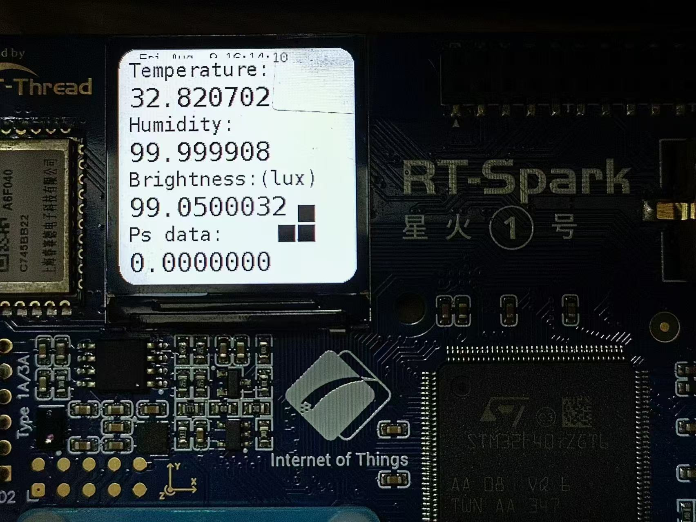

# 红外遥控贪吃蛇/显示+上传温度等数据到云平台
**梁浚超** 导师：**李镇鸿**
  
[成果展示视频链接(new)(https://www.bilibili.com/video/BV1VqeceTEts) ](https://www.bilibili.com/video/BV1VqeceTEts)  
[简略教程视频链接(https://www.bilibili.com/video/BV15uYqeME6t)](https://www.bilibili.com/video/BV15uYqeME6t)  
[成果展示视频链接(https://www.bilibili.com/video/BV1x3YSesEcw)](https://www.bilibili.com/video/BV1x3YSesEcw)  

## 主要内容

- [红外遥控贪吃蛇/显示+上传温度等数据到云平台](#红外遥控贪吃蛇显示上传温度等数据到云平台)
  - [主要内容](#主要内容)
  - [1. LCD显示温湿度等数据](#1-lcd显示温湿度等数据)
    - [1.1 LCD显示字符串](#11-lcd显示字符串)
    - [1.2 屏幕圆角](#12-屏幕圆角)
  - [2. LCD贪吃蛇小游戏](#2-lcd贪吃蛇小游戏)
    - [2.1 循环队列储存蛇身的坐标](#21-循环队列储存蛇身的坐标)
    - [2.2 放弃使用bool记录地图](#22-放弃使用bool记录地图)
    - [2.3 随机运动](#23-随机运动)
    - [2.4 引入按键](#24-引入按键)
    - [2.5 红外遥控](#25-红外遥控)
  - [3. 红外遥控](#3-红外遥控)
    - [3.1 填好对应的pin](#31-填好对应的pin)
    - [3.2 找到合适的遥控器](#32-找到合适的遥控器)
    - [3.3 基本操作](#33-基本操作)
    - [3.4 导致LCD闪烁](#34-导致lcd闪烁)
  - [4. 时间获取，显示](#4-时间获取显示)
  - [5. 菜单切换](#5-菜单切换)
  - [6. MQTT上传温湿度等数据到云平台](#6-mqtt上传温湿度等数据到云平台)
    - [6.1 简单修改](#61-简单修改)
    - [6.2 连接WiFi](#62-连接wifi)
    - [6.3 阿里云平台查看数据](#63-阿里云平台查看数据)
      - [光照强度](#光照强度)
      - [接近感应](#接近感应)
      - [蛇长](#蛇长)
      - [湿度](#湿度)
      - [温度](#温度)
    - [6.4 开启关闭MQTT](#64-开启关闭mqtt)
      - [展望](#展望)
  - [感谢](#感谢)


## 1. LCD显示温湿度等数据 
[成果展示视频链接1:10(new)(https://www.bilibili.com/video/BV1VqeceTEts) ](https://www.bilibili.com/video/BV1VqeceTEts) 

### 1.1 LCD显示字符串
左上角是（0，0） →x，↓y
``` c
void easy_show_lcd(char *title, float Temp)
{
    lcd_show_string(10, plus_lcd_y(24), 24, title);
    rt_sprintf(tmp, "%f", Temp);
    lcd_show_string(10, plus_lcd_y(32), 32, tmp);
}
```
### 1.2 屏幕圆角
勾股定理、⚪的公式
``` c
if ((newi * newi + newj * newj) > (r * r))
{
    lcd_black(i, j);
}
```
## 2. LCD贪吃蛇小游戏
[视频展示](https://www.bilibili.com/video/BV1WHafe1EBh/?spm_id_from=333.999.0.0&vd_source=4ac343050490681bfc3be821b46a4a18)
### 2.1 循环队列储存蛇身的坐标
``` c
int snake_head = 2, snake_tail = 0; // 蛇头，蛇尾
new_head_x = (snake_list[snake_head][0] + snake_direction[now_direction][0] + SNAKE_MAX) % (SNAKE_MAX);
```
### 2.2 放弃使用bool记录地图
内存不够
### 2.3 随机运动
``` c
int snake_direction[4][2] = {{0, -1}, {-1, 0}, {0, 1}, {1, 0}}; // 上，左，下，右
```

``` c
// 50%的概率保持当前方向
if (rand() % 100 < 50)
{
    new_direction = rand() % 3;
    now_direction = (now_direction + 3 + new_direction) % 4; // 防止反向、走回头路
}
```
### 2.4 引入按键
修改`now_direction`就可以了
### 2.5 红外遥控
## 3. 红外遥控
### 3.1 填好对应的pin
### 3.2 找到合适的遥控器
| 编号（key）| 功能 |
| :----: | :----: |
| 0x30| 上 |
| 0xE8 | 左 |
| 0xB0 | 下 |
| 0x68 | 右 |
| 0xFF | OK |
| 0x38 | 电源键 |
| 0xA8 | 静音 |
| 0x88 | 菜单 |
| 0x28 | 退出 |
### 3.3 基本操作
``` c
ir_select_decoder("nec");
infrared_read("nec", &infrared_data);
snake_compare(infrared_data.data.nec.key, infrared_data.data.nec.repeat);
rt_sprintf(tmp, "%02X", key);
```
### 3.4 导致LCD闪烁
[闪烁展示](https://www.bilibili.com/video/BV1frakeoEbc/?spm_id_from=333.999.0.0)
[问题解决](https://club.rt-thread.org/ask/article/23706daa8b2e9e55.html)
## 4. 时间获取，显示

[参考(https://blog.csdn.net/toopoo/article/details/113665077)](https://blog.csdn.net/toopoo/article/details/113665077)
``` c
void greattime()
{
    time_t cur_time;
    struct tm *info;
    cur_time = ntp_get_time(RT_NULL);
    info=localtime(&cur_time);
    strftime(tmp, 80, "%Y-%m-%d", info);
    lcd_show_string(40, 240/2-32-24, 32, tmp);
    strftime(tmp, 80, "%H:%M:%S", info);
    lcd_show_string(50, 240/2+24, 32, tmp);
    if (cur_time)
    {
        rt_kprintf("NTP Server Time: %s", ctime((const time_t *)&cur_time));
    }
}
```
## 5. 菜单切换
``` c
// 菜单（切换页面）
if (repeat == 0 && (rt_strcmp(tmp, "88") == 0 || rt_strcmp(tmp, "11") == 0))
{
    page_chosen = (page_chosen % PAGE_MAX) + 1;
    page_first = 1;
}
```
[展示1:51](https://www.bilibili.com/video/BV1VqeceTEts/?spm_id_from=333.999.0.0&vd_source=4ac343050490681bfc3be821b46a4a18)
## 6. MQTT上传温湿度等数据到云平台
### 6.1 简单修改
``` c
char tmp[];
rt_sprintf(tmp, "{\"params\":{\"temperature\":%.2f,\"humidity\":%.2f,\"LightLux\":%.2f,\"Psdata\":%d,\"Snakelen\":%d}}", Temp, Humi, brightness, ps_data, snake_len);
const char *fmt = "/sys/%s/%s/thing/event/property/post";
char *payload = tmp;
```
### 6.2 连接WiFi
``` c
rt_wlan_config_autoreconnect(RT_TRUE);
rt_wlan_connect("Dong", "abcd07691234");
system("myproject");
```
### 6.3 阿里云平台查看数据
#### 光照强度
 
#### 接近感应
 
#### 蛇长
 
#### 湿度
 
#### 温度

### 6.4 开启关闭MQTT

``` c
IOT_MQTT_Destroy(&pclient);
```
#### 展望
LVGL,网页/小程序展示操作  
  
  
  
  

## 感谢
RT-Thread和各位导师的指导